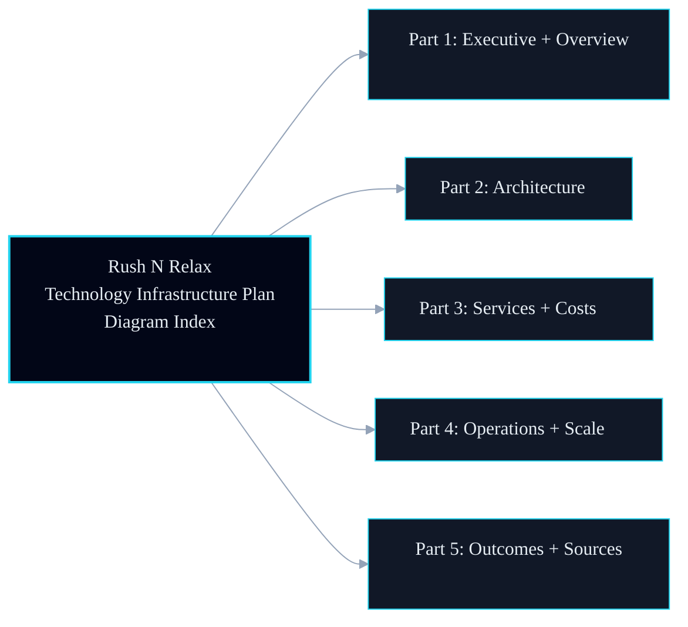
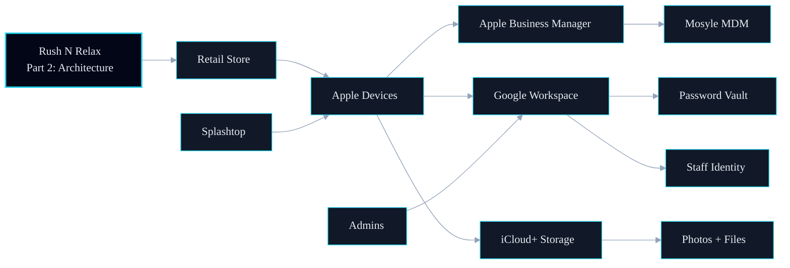

# Rush N Relax

## Technology Infrastructure Plan

Prepared for: Executive Team  
Prepared by: KB  
Date: March 2026

---

# How To Read This Deck

- Each slide shows one primary flow.
- Node count is intentionally limited for fast explanation.
- Supporting details remain in the source `.mmd` files.

---

# 1. Diagram Index

**Context Points**

- Use this slide as your agenda in under 20 seconds.
- Promise one clear story per section: strategy, architecture, cost, operations, outcomes.
- Keep detailed technical Q&A in the `.mmd` source files after the presentation.

---

# 2. Executive + Overview

```mermaid
%%{init: {'theme': 'base', 'themeVariables': {'background': '#0b0f17', 'primaryColor': '#111827', 'primaryTextColor': '#e6edf3', 'primaryBorderColor': '#22d3ee', 'lineColor': '#94a3b8', 'secondaryColor': '#0f172a', 'tertiaryColor': '#111827', 'clusterBkg': '#0f172a', 'clusterBorder': '#22d3ee', 'fontFamily': 'Avenir Next, Avenir, Segoe UI, sans-serif'}}}%%

flowchart LR

    T["Rush N Relax<br/>Part 1: Executive + Overview"]:::title

    V1["Hybrid Apple + Google retail stack"]
    V2["Corporate-owned Apple devices"]
    V3["Zero-touch setup with ABM + Mosyle"]
    V4["Google Workspace for admins"]
    V5["Cloud Identity for store staff"]
    V6["Support + storage + credentials"]
    V7["Outcome: secure, low-cost, scalable ops"]

    T --> V1 --> V2 --> V3 --> V4 --> V6 --> V7
    V4 --> V5

    click T "#" "Slide 2 summary: strategy and operating model"
    click V1 "#" "Use Apple devices plus Google identity/collaboration"
    click V2 "#" "Devices are business-owned, not tied to personal accounts"
    click V3 "#" "ABM + Mosyle enables zero-touch rollout"
    click V4 "#" "Workspace powers admin email, docs, and SSO"
    click V5 "#" "Store staff can use free Cloud Identity accounts"
    click V6 "#" "Support, storage, and credential tools complete the stack"
    click V7 "#" "Business result: consistent and scalable operations"

    classDef title fill:#020617,color:#e6edf3,stroke:#22d3ee,stroke-width:2px;
```

**Context Points**

- The strategy is hybrid by design: Apple for devices, Google for identity and collaboration.
- Zero-touch provisioning is the key operational unlock for multi-store growth.
- The outcome is not just technical consistency, it is lower labor overhead per new location.

---

# 3. Architecture

**Context Points**

- Device control path: `Store -> Apple Devices -> ABM -> Mosyle`.
- Identity and access path: `Admins -> Workspace -> Staff Identity`.
- Support and assets are intentionally separated: `Splashtop` for operations, `iCloud+` for files.

---

# 4. Services + Costs

```mermaid
%%{init: {'theme': 'base', 'themeVariables': {'background': '#0b0f17', 'primaryColor': '#111827', 'primaryTextColor': '#e6edf3', 'primaryBorderColor': '#22d3ee', 'lineColor': '#94a3b8', 'secondaryColor': '#0f172a', 'tertiaryColor': '#111827', 'clusterBkg': '#0f172a', 'clusterBorder': '#22d3ee', 'fontFamily': 'Avenir Next, Avenir, Segoe UI, sans-serif'}}}%%

flowchart LR

    T["Rush N Relax<br/>Part 3: Services + Costs"]:::title

    S1["Google Workspace\n$28/mo"]
    S2["Mosyle MDM\n$20/mo"]
    S3["Splashtop\n$8.25/mo"]
    S4["iCloud+\n$9.99/mo"]
    S5["Password Manager\n~$24/mo"]
    S6["Apple Business Manager\n$0/mo"]
    TOTAL["Total recurring\n$90.24/mo\n~$1,082.88/yr"]
    OPT["Cloud Identity\noptional, free"]

    T --> S1 --> S2 --> S3 --> S4 --> S5 --> S6 --> TOTAL
    OPT -. optional .-> S1

    click T "#" "Slide 4 summary: recurring service spend"
    click S1 "#" "Workspace licenses for admin users"
    click S2 "#" "Mosyle licensing for managed devices"
    click S3 "#" "Remote support subscription"
    click S4 "#" "Shared cloud storage plan"
    click S5 "#" "Shared password platform licensing"
    click S6 "#" "ABM has no recurring cost"
    click TOTAL "#" "Executive view: total monthly and annual run rate"
    click OPT "#" "Optional free identity extension for staff"

    classDef title fill:#020617,color:#e6edf3,stroke:#22d3ee,stroke-width:2px;
```

**Context Points**

- This is a recurring-cost stack, optimized for predictable monthly spend.
- `Apple Business Manager` stays at `$0`, while Mosyle and Workspace drive operational value.
- Use the total node as the executive decision anchor: `~$90-95/month` at planned scale.

---

# 5. Operations + Scale

```mermaid
%%{init: {'theme': 'base', 'themeVariables': {'background': '#0b0f17', 'primaryColor': '#111827', 'primaryTextColor': '#e6edf3', 'primaryBorderColor': '#22d3ee', 'lineColor': '#94a3b8', 'secondaryColor': '#0f172a', 'tertiaryColor': '#111827', 'clusterBkg': '#0f172a', 'clusterBorder': '#22d3ee', 'fontFamily': 'Avenir Next, Avenir, Segoe UI, sans-serif'}}}%%

flowchart LR

    T["Rush N Relax<br/>Part 4: Operations + Scale"]:::title

    Z1["Buy device"]
    Z2["Assign in ABM"]
    Z3["Boot at store"]
    Z4["Auto-enroll in Mosyle"]
    Z5["Apply policy + apps"]
    Z6["Sign in to Google"]
    Z7["Ready for operations"]
    Z8["Scale to 10 stores / 20 devices"]
    Z9["Run at ~$90-95/mo"]

    T --> Z1 --> Z2 --> Z3 --> Z4 --> Z5 --> Z6 --> Z7 --> Z8 --> Z9

    click T "#" "Slide 5 summary: repeatable rollout workflow"
    click Z1 "#" "Procure approved Apple hardware"
    click Z2 "#" "Assign ownership in Apple Business Manager"
    click Z3 "#" "First boot at the store location"
    click Z4 "#" "Device enrolls into Mosyle automatically"
    click Z5 "#" "Security baseline and apps are applied"
    click Z6 "#" "User authenticates with Google identity"
    click Z7 "#" "Device enters production-ready state"
    click Z8 "#" "Model scales consistently across new stores"
    click Z9 "#" "Target operating cost at full planned scale"

    classDef title fill:#020617,color:#e6edf3,stroke:#22d3ee,stroke-width:2px;
```

**Context Points**

- This flow is your rollout playbook for each new store opening.
- The process minimizes manual setup and reduces configuration drift risk.
- Scaling from 3 to 10 stores is operationally linear, not a bespoke IT project each time.

---

# 6. Outcomes + Sources

```mermaid
%%{init: {'theme': 'base', 'themeVariables': {'background': '#0b0f17', 'primaryColor': '#111827', 'primaryTextColor': '#e6edf3', 'primaryBorderColor': '#22d3ee', 'lineColor': '#94a3b8', 'secondaryColor': '#0f172a', 'tertiaryColor': '#111827', 'clusterBkg': '#0f172a', 'clusterBorder': '#22d3ee', 'fontFamily': 'Avenir Next, Avenir, Segoe UI, sans-serif'}}}%%

flowchart LR

    T["Rush N Relax<br/>Part 5: Outcomes + Sources"]:::title

    B1["Benefits: security + speed + consistency"]
    B2["Benefits: remote support + asset sharing"]
    B3["Benefits: scalable and startup-friendly"]
    C1["Conclusion: centralized platform for multi-store growth"]
    S1["Evidence: vendor pricing sources"]
    S2["Evidence: ABM, Mosyle, Workspace docs"]
    S3["Evidence: costs current as of March 2026"]

    T --> B1 --> B2 --> B3 --> C1 --> S1 --> S2 --> S3

    click T "#" "Slide 6 summary: business outcomes and evidence"
    click B1 "#" "Security and consistency improve operational confidence"
    click B2 "#" "Support and asset sharing reduce friction"
    click B3 "#" "Design supports efficient expansion"
    click C1 "#" "Conclusion: centralized platform for growth"
    click S1 "#" "Pricing references for cost assumptions"
    click S2 "#" "Product documentation references for architecture choices"
    click S3 "#" "Timestamp for pricing and assumption validity"

    classDef title fill:#020617,color:#e6edf3,stroke:#22d3ee,stroke-width:2px;
```

**Context Points**

- Benefits are framed as business outcomes first, technology second.
- Conclusion ties platform design directly to multi-location growth readiness.
- Sources defend cost and design assumptions for stakeholders who want verification.

---

# Optional: Tooltip Features

- Mermaid supports node tooltips and links with `click` directives.
- This works best in Mermaid-native viewers; some slide renderers may limit interactivity.
- Keep this optional so exported PDF slides remain clean.

---

# Presenter Notes

- Lead with business outcomes, then show architecture.
- Keep technical details to backup discussion unless asked.
- Anchor cost and scale claims to the sources slide.
