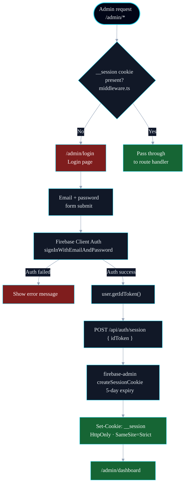
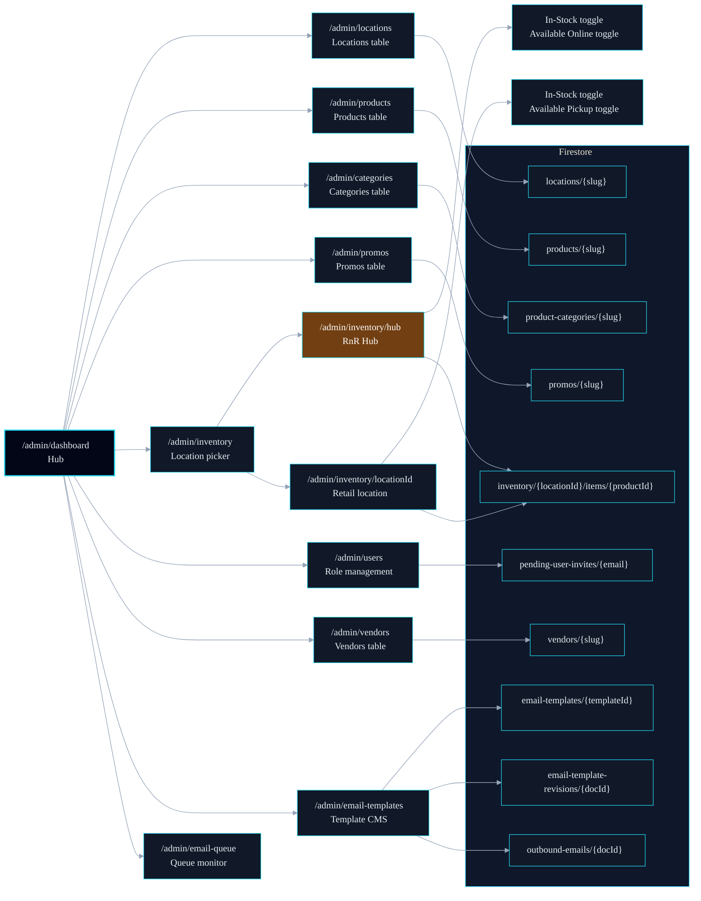

# Admin CMS — Module Architecture

> Server-side admin interface for managing Rush N Relax content and inventory.
> Auth is enforced at the middleware layer via Firebase session cookies.
> Style governed by [mermaid-standard.md](./mermaid-standard.md).

---

## Auth Flow

How an admin session is established and protected.

### Legend

| Abbrev | Meaning                                       |
| ------ | --------------------------------------------- |
| MW     | `src/middleware.ts` — Edge runtime auth guard |
| FBA    | Firebase Client Auth (`firebase/auth`)        |
| SAPI   | `src/app/api/auth/session/route.ts`           |
| ADMIN  | Firebase Admin SDK (`firebase-admin/auth`)    |

### Key Paths

- All `/admin/*` routes except `/admin/login` require the `__session` cookie.
- The cookie is set server-side (HTTP-only) — not accessible to client JS.
- Admin login uses Firebase Google popup auth, then exchanges ID token at `/api/auth/session`.
- Admin authorization is claims-first: routes and actions require a custom `role` claim with minimum `owner`.
- No Firestore `users/{uid}` profile document is required for admin access; Auth emulator / Firebase Auth custom claims are the authority.
- If the signing-in email is listed in `ADMIN_OWNER_ALLOWLIST` and has no owner claim yet,
  `/api/auth/session` applies `role: owner` and returns `409` with `CLAIMS_UPDATED_RETRY`.
- Client login then refreshes the ID token once and retries session exchange automatically.
- Firebase Client Auth and the session cookie are separate: Client Auth is for the ID token exchange only; the session cookie is the actual server gate.
- Phase 4 can upgrade to full JWT verification in middleware by switching to `runtime = 'nodejs'`.

---

## CMS Module Map

All admin routes and their data sources.

### Legend

| Abbrev    | Meaning                                                               |
| --------- | --------------------------------------------------------------------- |
| DASH      | `/admin/dashboard` — navigation hub                                   |
| LOC       | Locations CMS page                                                    |
| PROD      | Products CMS page                                                     |
| CAT       | Categories CMS page                                                   |
| PROMO     | Promos CMS page                                                       |
| INV       | Inventory module — Phase 2                                            |
| USERS     | Users module — owner-only invite + custom-claim role assignments      |
| VENDORS   | Vendors CMS page — owner-only                                         |
| EMAIL_TPL | Email template CMS — owner-only live editor + preview                 |
| EMAIL_Q   | Outbound email queue monitor — owner-only operational console         |
| HUB       | RnR Hub — non-physical warehouse location (`HUB_LOCATION_ID = 'hub'`) |
| FS        | Firestore database                                                    |

### Key Paths

- Dashboard is the entry point after login — all CMS modules link from here.
- Users module manages non-owner role claims (`storeOwner`, `storeManager`, `staff`, `customer`) by UID/email.
- Users module now supports Owner-only pending invites at `pending-user-invites/{email}`.
- Firestore no longer carries a runtime `users/{uid}` RBAC document; pending invites plus Firebase Auth claims fully define admin access.
- Invite flow is email-first: owner saves invite email + role, user signs in with Google, and `/api/auth/session` applies the invite role claim and returns `CLAIMS_UPDATED_RETRY` for token refresh.
- Email template CMS is owner-only at `/admin/email-templates`; templates are stored in `email-templates/{templateId}`.
- Email template CMS now supports loading any saved template from a dropdown (`templateId` query param), with revisions and restore scoped to the selected template ID.
- Template saves also append immutable snapshots at `email-template-revisions/{docId}` so operators can review and restore earlier versions.
- Email template CMS includes a test-send action that enqueues a synthetic contact submission email through the same `outbound-emails/{docId}` pipeline.
- Restoring a template revision writes the selected snapshot back to the live template and records a new `source = restore` revision for auditability.
- Email queue monitor is owner-only at `/admin/email-queue`; it surfaces queue state and allows manual requeue of `failed`/`dead-letter` jobs.
- Inventory is the only module with a nested route (`[locationId]`).
- Hub inventory items have an `availableOnline` flag — toggles online shipping availability (Phase 3A).
- Retail inventory items have an `availablePickup` flag — toggles buy-online / pick-up-in-store (Phase 3A).
- Compliance guard: setting either flag is blocked if the product's status is `compliance-hold`.
- Vendors admin is owner-only at `/admin/vendors`; full CRUD — list, create (`/new`), edit (`/[slug]/edit`), archive/restore toggle. Vendors are stored in `vendors/{slug}` (doc ID = slug, immutable after creation). Each vendor has `name`, `slug`, `website`, `logoUrl`, `description`, `categories` (string array), and `isActive`. Archiving sets `isActive: false` — vendor remains in Firestore for history but is hidden from storefront queries (`listVendors()` filters to active only).
- Categories admin is owner-only at `/admin/categories`; full CRUD — list, create (`/new`), edit (`/[slug]/edit`), and activate/deactivate toggle. Categories are stored in `product-categories/{slug}`.
- Category slugs are immutable after creation (doc ID = slug). The edit form disables the slug field.
- Deactivating a category hides it from the storefront filter bar and all product admin dropdowns — no code deploy required.
- Product admin forms (`/admin/products/new` and `/admin/products/[slug]/edit`) source their category dropdown from `listActiveCategories()` — Firestore is the source of truth, not a TypeScript union.
- All admin pages use `export const dynamic = 'force-dynamic'` — no static prerender at build time.
- Writes go through Server Actions (`actions.ts`) which call the repository layer directly.
- Location `placeId` is optional in admin forms; when absent, maps fall back to address queries and reviews remain unavailable until a Place ID is added.
- Contact form submissions are now server-side queued for email dispatch:
  `contact-submissions/{docId}` stores inbound payload and `outbound-emails/{docId}` stores queue/send status.
- Outbound contact emails are dispatched by Cloud Functions using Resend API credentials from Functions secrets (`RESEND_API_KEY`).
- Contact and test-email queue jobs now snapshot the rendered subject and HTML at enqueue time so admin preview, test sends, and production delivery stay aligned.
- Cloud Functions dispatch the queued subject/HTML directly, with Firestore template rendering kept as a fallback for legacy jobs (`contact-submission-default`).
- Failed outbound emails are retried by a scheduled Cloud Function with exponential backoff metadata stored on the queue doc (`attemptCount`, `nextAttemptAt`, `lastAttemptAt`).
- Repository upserts sanitize `undefined` optional fields before Firestore `set(..., { merge: true })` to prevent runtime write errors from sparse form payloads.
- Product image upload is handled by two API routes — not Server Actions — to avoid the 1 MB Server Action body size limit:
  - `POST /api/admin/products/upload-image` — validates owner role, MIME type (jpeg/png/webp), 5 MB max, uploads to Firebase Storage via Admin SDK, returns `{ path: string }`.
  - `DELETE /api/admin/products/delete-image` — validates owner role and that the path starts with `products/` (path traversal guard), deletes from Storage.
- The `ProductImageUpload` widget uploads on file select/drop (not on form submit). Storage paths are stored in hidden form inputs and read by the Server Action on submit — no file bytes on submit.
- Image widget uses React 19 hooks: `useOptimistic` for instant local previews, `useTransition` for non-blocking upload fetch calls, `useFormStatus` to disable controls while the parent form is submitting.
- Gallery slots (up to 5) support drag-to-reorder via `@dnd-kit/sortable` — same pattern as the dashboard card grid. Order is persisted via hidden inputs on form submit.
- Storage bucket: `rush-n-relax.firebasestorage.app`. The `storageBucket` property must be set in `initializeApp()` in `src/lib/firebase/admin.ts` — calling `.bucket()` with no argument fails without it.
- Inventory semantics are strict and derived at repository level:
  `inStock = quantity > 0`, and `availableOnline`/`availablePickup` are forced `false` whenever quantity is `0`.
- Inventory writes now append an immutable adjustment log at
  `inventory/{locationId}/items/{productId}/adjustments/{adjustmentId}` in the same batch as the item write.
- Adjustment payload includes before/after snapshots (`previous*`/`next*`), computed delta (`deltaQuantity`), `changedFields`, `reason`, `source`, `updatedBy`, and `createdAt`.
- `InventoryItem.variantPricing` is a map of `variantId → { price, compareAtPrice?, inStock? }`. Keys correspond to `ProductVariant.variantId` values from `Product.variants`. Pricing is per-location — the same product can have different prices at hub vs. retail.
- `setInventoryItem` accepts `variantPricing` in the patch object. When present, it is merged atomically with the item write and `'variantPricing'` is added to `changedFields` in the audit record.
- The `'price-update'` reason is available in `InventoryAdjustmentReason` for pricing-only audit records.
