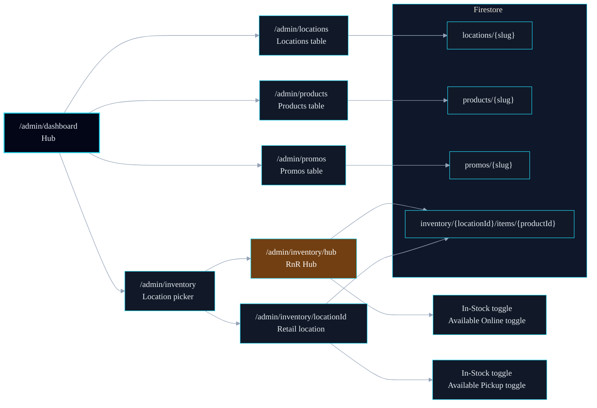

# Admin CMS — Module Architecture

> Server-side admin interface for managing Rush N Relax content and inventory.
> Auth is enforced at the middleware layer via Firebase session cookies.
> Style governed by [mermaid-standard.md](./mermaid-standard.md).

---

## Auth Flow

How an admin session is established and protected.

### Legend

| Abbrev | Meaning                                       |
| ------ | --------------------------------------------- |
| MW     | `src/middleware.ts` — Edge runtime auth guard |
| FBA    | Firebase Client Auth (`firebase/auth`)        |
| SAPI   | `src/app/api/auth/session/route.ts`           |
| ADMIN  | Firebase Admin SDK (`firebase-admin/auth`)    |

### Key Paths

- All `/admin/*` routes except `/admin/login` require the `__session` cookie.
- The cookie is set server-side (HTTP-only) — not accessible to client JS.
- Firebase Client Auth and the session cookie are separate: Client Auth is for the ID token exchange only; the session cookie is the actual server gate.
- Phase 4 can upgrade to full JWT verification in middleware by switching to `runtime = 'nodejs'`.

---

## CMS Module Map

All admin routes and their data sources.

### Legend

| Abbrev | Meaning                                                               |
| ------ | --------------------------------------------------------------------- |
| DASH   | `/admin/dashboard` — navigation hub                                   |
| LOC    | Locations CMS page                                                    |
| PROD   | Products CMS page                                                     |
| PROMO  | Promos CMS page                                                       |
| INV    | Inventory module — Phase 2                                            |
| HUB    | RnR Hub — non-physical warehouse location (`HUB_LOCATION_ID = 'hub'`) |
| FS     | Firestore database                                                    |

### Key Paths

- Dashboard is the entry point after login — all CMS modules link from here.
- Inventory is the only module with a nested route (`[locationId]`).
- Hub inventory items have an `availableOnline` flag — toggles online shipping availability (Phase 3A).
- Retail inventory items have an `availablePickup` flag — toggles buy-online / pick-up-in-store (Phase 3A).
- Compliance guard: setting either flag is blocked if the product's status is `compliance-hold`.
- All admin pages use `export const dynamic = 'force-dynamic'` — no static prerender at build time.
- Writes go through Server Actions (`actions.ts`) which call the repository layer directly.
- Repository upserts sanitize `undefined` optional fields before Firestore `set(..., { merge: true })` to prevent runtime write errors from sparse form payloads.
- Inventory semantics are strict and derived at repository level:
  `inStock = quantity > 0`, and `availableOnline`/`availablePickup` are forced `false` whenever quantity is `0`.
- Inventory writes now append an immutable adjustment log at
  `inventory/{locationId}/items/{productId}/adjustments/{adjustmentId}` in the same batch as the item write.
- Adjustment payload includes before/after snapshots (`previous*`/`next*`), computed delta (`deltaQuantity`), `changedFields`, `reason`, `source`, `updatedBy`, and `createdAt`.
