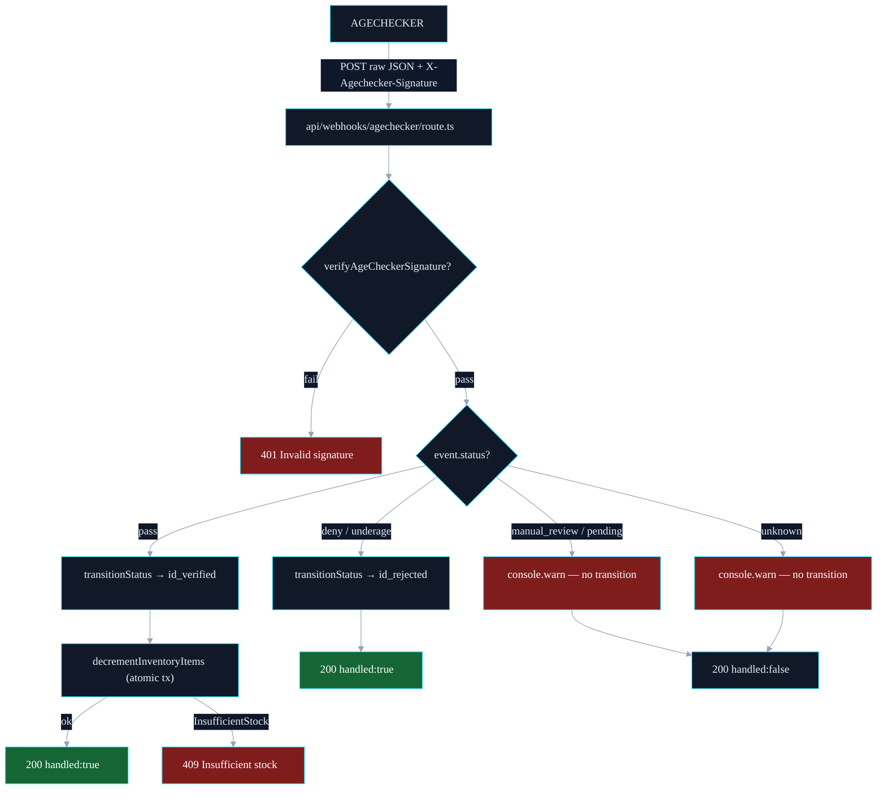

# AgeChecker.Net Integration Research

> Status: research spike (issue #271). Public-source findings only — full API/webhook contract is gated behind a registered merchant account (`/account` → Install tab → API docs). Items marked **[GAP]** require either a live account or a support ticket to `help@agechecker.net` / `contact@agechecker.net` to confirm. Gates issues #6 (webhook handler design) and #8 (storefront flow).

## Sources Consulted

- <https://agechecker.net/age-verification-api> — public marketing page
- <https://agechecker.net/faq> — Verification FAQ + Merchant FAQ
- <https://agechecker.net/features>
- Public site CSP allow-listing of `cdn.agechecker.net` (popup script delivery)
- No public docs portal exists at `docs.agechecker.net` or `api.agechecker.net` (both return non-doc content / are not exposed)
- API documentation explicitly described as account-gated:
  > "Register to view our API docs and see advanced configuration options, such as passing in custom metadata, using a callback URL, or automatically emailing/texting a customer for asynchronous verification."
  > "You will find platform-specific installation guides under the Install tab of your account dashboard… Under the same tab, you can view our API documentation."

## What's Public (confirmed)

### Verification model

- Two integration shapes: **Popup** (drop-in JS from `cdn.agechecker.net`) and **API** (server-to-server, with optional popup fallback for ID upload).
- Verification path:
  1. Submit name + DOB + address. ~90% of US customers verify instantly via public-records match.
  2. If no match, customer is prompted for a government photo ID (webcam, file upload, or SMS hand-off to phone).
  3. Photo-ID review takes 10–30s typically (FAQ).
- Photo IDs are **not stored** by default — deleted after verification. Optional consented retention exists for compliance-required merchants.
- Once verified on any AgeChecker-network site, the buyer is verified across the network — i.e. AgeChecker maintains a cross-merchant identity record keyed on name + DOB + address.

### Configuration knobs (from marketing copy)

- Pre- and post-verification JS callbacks on the popup.
- Server-side **callback URL** (i.e. webhook) — explicitly mentioned for the API integration.
- Custom metadata can be passed through the verification request and echoed back.
- Asynchronous verification mode: AgeChecker can email/SMS the customer to complete verification later.
- Per-website rules: minimum age, country/state/county/city/ZIP block-lists, wholesale-customer exclusions, per-product-tag exclusions.

### Re-verification rules (FAQ — verbatim)

- "If you've uploaded an ID once and use the same name, address, and date of birth for your next order, you won't be asked to submit an ID again."
- Identity match is on `(name, address, DOB)` triple — any change re-triggers the ID prompt.
- Merchants **can** override and require ID on every order.
- Page-reload grace window: **20 minutes** to re-verify without re-billing the merchant after a forced reload (e.g. card decline, invalid field). This is the only public TTL value AgeChecker publishes.

### Billing signal (relevant to webhook semantics)

- Merchants are billed **$0.50 per accepted verification**, no charge for declines or abandons.
- Strong implication: AgeChecker's backend distinguishes at least three terminal states — `accepted`, `declined`, `abandoned` — even if only `accepted` triggers billing. **[GAP]** confirm whether each maps to a distinct webhook event.

## What's NOT Public — Open Questions

These are the issue-271 acceptance items that we cannot answer from public sources. We have two options to close each: (a) sign up for a merchant account (recommended — likely needed for #6/#8 anyway) and pull docs from the Install tab, or (b) email `contact@agechecker.net` with the specific questions.

### 1. Session TTL **[GAP]**

- Only public TTL: **20-minute re-verify window** after a forced page reload.
- Unknown: lifetime of a _successful_ verification token / session as seen by the merchant. Likely options based on industry norms: (a) one-shot token bound to a single order, (b) cookie/session bound to browser for N days, (c) server-side record keyed on customer identity that the merchant queries each checkout.
- AgeChecker's "verified once, verified across the network" copy suggests the canonical record is **server-side and identity-keyed**, not a short-lived session token. Merchants likely query verification status by `(email | customer_id | metadata)` per checkout.
- **Action:** confirm via API docs — specifically the GET-verification-status endpoint and any token expiry on the popup-issued artifact.

### 2. Abandon behavior **[GAP]**

- Public copy confirms abandons exist as a billable-distinct state ("you will not be charged if a customer… leaves in the middle of the age verification process").
- Unknown: whether the merchant receives a webhook on abandon or whether the session simply ages out silently. Asynchronous-verification mode (email/SMS the customer to finish later) implies AgeChecker has a notion of an "open, unfinished" verification — this almost certainly emits at least one terminal event when it eventually expires.
- **Action:** confirm webhook event list. Specifically ask: is there an `abandoned` / `expired` / `timeout` event, and what is its trigger latency from last user activity?

### 3. Return URL contract **[GAP]**

- Public copy mentions a "callback URL" for API integrations and "post-verification callbacks" for the popup, but does not specify:
  - HTTP method (likely GET for browser return, POST for server webhook — but unconfirmed).
  - Field set on the return URL — assumed: `verificationId`, `status`, possibly `metadata` echo, `customerEmail`, `signature`.
  - Whether the return URL is **signed** (HMAC of payload with merchant secret) or relies solely on TLS + a server-side status fetch. Industry norm for KYC/age-verify vendors is HMAC-SHA256 over the query string with a per-account shared secret.
- **Action:** confirm — and if signed, document signing algorithm + canonical-string format. If unsigned, our handler MUST treat the return URL as untrusted and re-fetch verification status server-to-server before granting access.

### 4. Webhook event names + retry policy **[GAP]**

- No public list. Likely candidates by analogy to similar vendors:
  - `verification.accepted`
  - `verification.declined`
  - `verification.manual_review` (when ID is queued for human review)
  - `verification.completed` (terminal after manual_review)
  - `verification.abandoned` / `verification.expired`
- Retry policy on `manual_review` → `completed` transition is the critical unknown for #6: human review can take minutes to hours, so the handler must be idempotent and the merchant must tolerate at-least-once delivery. AgeChecker's async-verification mode (email/SMS, "complete later") strongly implies long-running cases are normal.
- **Action:** confirm exact event names, payload schema, signing scheme, and retry/back-off policy.

## Provisional Design Implications (for #6 / #8)

Until the gaps are closed, design assumptions we should bake in:

1. **Treat return URL as untrusted.** On callback, re-query AgeChecker server-to-server using the `verificationId` before granting access. This is safe regardless of whether the URL turns out to be signed.
2. **Webhook handler must be idempotent** keyed on `verificationId` — `manual_review` retries and out-of-order delivery are likely.
3. **Merchant-side verification record should be identity-keyed**, not session-keyed, so we can short-circuit re-verification for returning customers (matches AgeChecker's own "verified across the network" model).
4. **Tolerate long-running `manual_review` states.** Storefront flow (#8) needs a "verification pending — we'll email you when ready" path, not just synchronous accept/decline.
5. **20-minute reload grace is a UX hint, not a security boundary.** Don't rely on it for our own session TTL.

## Next Steps to Close This Spike

- [ ] Create a merchant trial account on AgeChecker.Net.
- [ ] Pull the API docs PDF/page from the Install tab; commit a redacted excerpt (event names, payload schema, signing) into this file under a "Confirmed from merchant docs" section.
- [ ] Email `contact@agechecker.net` with the four **[GAP]** questions above if the docs are still ambiguous.
- [ ] Once confirmed, unblock #6 (webhook handler) and #8 (storefront flow).

---

## Webhook Handler — Current Behavior

> Implemented in `apps/web/src/app/api/webhooks/agechecker/route.ts` (#275). Authoritative outcome for ID verification — drives the `pending_id_verification → id_verified | id_rejected` transition.

### Flow

### Status → Action Matrix

| AgeChecker `status`        | Order transition     | Side effect                                       | HTTP |
| -------------------------- | -------------------- | ------------------------------------------------- | ---- |
| `pass`                     | `id_verified`        | Atomic inventory decrement.                       | 200  |
| `pass` (already processed) | (none)               | Idempotency — InvalidTransitionError swallowed.   | 200  |
| `pass` + oversell          | `id_verified` (kept) | Inventory tx rolled back; ops must refund/cancel. | 409  |
| `deny`                     | `id_rejected`        | None.                                             | 200  |
| `underage`                 | `id_rejected`        | None.                                             | 200  |
| `manual_review`            | (none)               | `console.warn` log only.                          | 200  |
| `pending`                  | (none)               | `console.warn` log only.                          | 200  |
| terminal w/o `orderId`     | (none)               | `console.warn` — cannot bind.                     | 200  |
| unknown                    | (none)               | `console.warn` — ack to stop retries.             | 200  |

### Idempotency

AgeChecker may retry on transient failures. The handler relies on `transitionStatus` throwing `InvalidTransitionError` when the order has already moved past `pending_id_verification` — that error is caught and converted to a 200 with `handled: false, reason: 'already_processed'` so the provider stops retrying.

### Inventory Decrement (post-#275)

On `pass`, after the order transitions to `id_verified`, `decrementInventoryItems(locationId, items)` runs in a Firestore transaction. Any line short on stock throws `InsufficientStockError` and the **entire** decrement rolls back. The order is **left in `id_verified`** (the ID itself is valid) — operations must reconcile out of band by refunding or cancelling. The handler returns 409 with `{ productId, available, requested }` for ops visibility.

### Configuration

| Var                         | Purpose                                          | Where set       |
| --------------------------- | ------------------------------------------------ | --------------- |
| `AGECHECKER_WEBHOOK_SECRET` | HMAC secret for `x-agechecker-signature` verify. | Vercel env vars |
| `AGECHECKER_API_KEY`        | Server-to-server status fetch (when needed).     | Vercel env vars |

| Setting          | Value                                                      |
| ---------------- | ---------------------------------------------------------- |
| Webhook URL      | `https://<host>/api/webhooks/agechecker`                   |
| Signature header | `x-agechecker-signature` (HMAC-SHA256 hex of raw body)     |
| Test mode        | AgeChecker merchant dashboard → Install → Test Mode toggle |
| Method           | `POST` with raw JSON body                                  |

### Local Testing

The handler reads the raw body before JSON.parse so signature verification works against the byte stream. To test locally, compute the HMAC against `AGECHECKER_WEBHOOK_SECRET` and POST to `http://localhost:3000/api/webhooks/agechecker` with the `x-agechecker-signature` header set.
