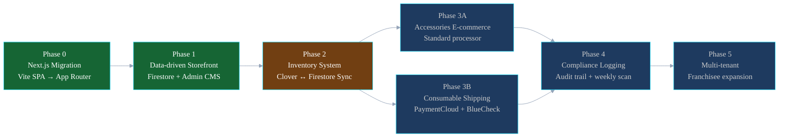
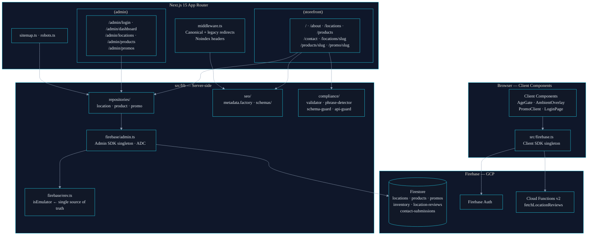
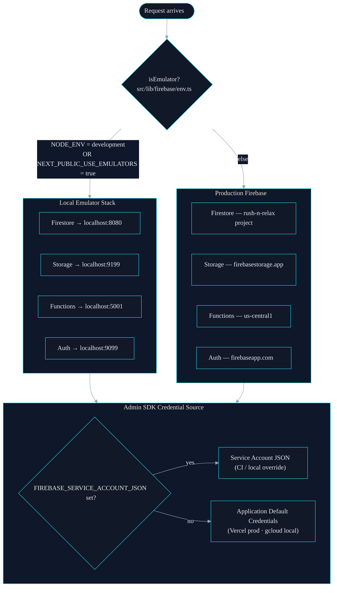
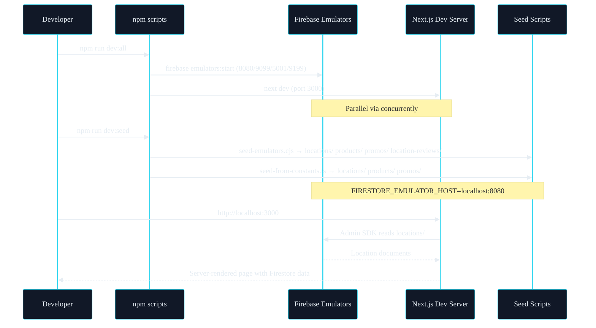
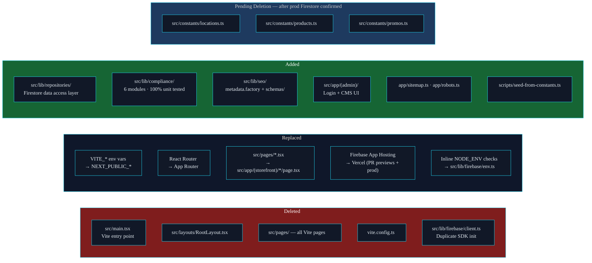

# Rush N Relax — Web App Architecture

> Living engineering reference. 10,000 ft view of the platform — phases, layers, environment routing, and dev workflow.
> Style governed by [mermaid-standard.md](./mermaid-standard.md).

---

## Phase Roadmap

Current delivery status across all planned platform phases.



### Legend

| Abbrev | Meaning                                                   |
| ------ | --------------------------------------------------------- |
| SPA    | Single-Page Application (previous Vite architecture)      |
| ADC    | Application Default Credentials (Firebase auth in Vercel) |
| CMS    | Content Management System (admin UI)                      |
| POS    | Point of Sale (Clover integration target)                 |

### Key Paths

- Phase 0 and 1 are complete and in production.
- Phase 2 (Clover sync) is the active next milestone.
- Phase 3A/3B can run in parallel once inventory is stable.
- Compliance logging (Phase 4) gates the multi-tenant rollout.

---

## Current Architecture

Full layer view of the web app post Phase 0 + Phase 1.



### Legend

| Abbrev | Meaning                                             |
| ------ | --------------------------------------------------- |
| CSK    | Client SDK — `src/firebase.ts`                      |
| CC     | Client Components (React `'use client'`)            |
| MW     | Next.js middleware                                  |
| SF     | `(storefront)` Next.js route group                  |
| ADM    | `(admin)` Next.js route group                       |
| LIB    | `src/lib/` — server-only modules                    |
| ENV    | `src/lib/firebase/env.ts` — emulator flag           |
| ADMIN  | `src/lib/firebase/admin.ts` — Admin SDK singleton   |
| REPO   | `src/lib/repositories/` — all Firestore access      |
| SEO    | `src/lib/seo/` — metadata factory + schema builders |
| COMP   | `src/lib/compliance/` — content validation          |
| GCP    | Google Cloud Platform / Firebase                    |
| FS     | Firestore database                                  |
| FN     | Cloud Functions v2                                  |

### Key Paths

- All Firestore reads go through `REPO → ADMIN → FS`. Pages never import `firebase/firestore` directly.
- `ENV` is the single gating point for emulator vs. production routing.
- Client SDK (`CSK`) only reaches Auth and Functions directly — never Firestore.
- `COMP` validates content at the server layer before it reaches SEO or the response.

---

## Firebase Environment Routing

How `isEmulator` routes SDK calls at runtime.



### Legend

| Abbrev | Meaning                         |
| ------ | ------------------------------- |
| ADC    | Application Default Credentials |
| EMU    | Firebase Local Emulator Suite   |
| PROD   | Production Firebase on GCP      |
| SC     | Service Account JSON credential |

### Key Paths

- `isEmulator` is evaluated once at module load in `src/lib/firebase/env.ts`.
- Both the Admin SDK and Client SDK import from that single file — no scattered inline checks.
- Admin SDK credential source is separate from the emulator/prod routing decision.

---

## Dev Workflow

End-to-end local development sequence.



### Key Paths

- `dev:all` starts both services in parallel — no manual ordering required.
- `dev:seed` must be run after emulators are ready (emulators first, then seed).
- All Admin SDK calls in dev automatically route to `localhost:8080` via `isEmulator`.

---

## Migration: Vite SPA → Next.js 15

What changed, what was deleted, and what was added.



### Legend

| Abbrev | Meaning                                                          |
| ------ | ---------------------------------------------------------------- |
| SPA    | Single-Page Application (Vite)                                   |
| ADM    | `(admin)` Next.js route group                                    |
| SF     | `(storefront)` Next.js route group                               |
| GH     | GitHub                                                           |
| GATE   | Files gated for deletion after Firestore production confirmation |

### Key Paths

- `src/constants/` files are not the source of truth anymore — Firestore is. Delete them after prod seed is confirmed.
- `src/lib/firebase/env.ts` replaced 3 separate inline `NODE_ENV` checks that had diverged.
- The Admin SDK path (`firebase/admin.ts`) previously missed `NODE_ENV === 'development'` — now fixed via the shared `isEmulator` flag.

---

## Phase 2 — Inventory Scope Preview

New files for Clover POS ↔ Firestore bidirectional sync.

```
src/lib/clover/
├── client.ts                          # Clover REST API wrapper (server-only)
├── webhook.ts                         # Signature validation + event parsing
└── sync.ts                            # Inventory diff logic

src/app/api/clover/
├── webhook/route.ts                   # POST — receives Clover POS events
└── sync/route.ts                      # POST — manual sync trigger

src/lib/repositories/
└── inventory.repository.ts            # inventory/{locationId}/items/

src/types/
└── inventory.ts                       # CloverItem · InventorySnapshot

src/app/(admin)/admin/
└── inventory/[locationId]/page.tsx    # Admin inventory view + sync button
```

Mermaid sync flow diagram will be added when Phase 2 planning begins.
