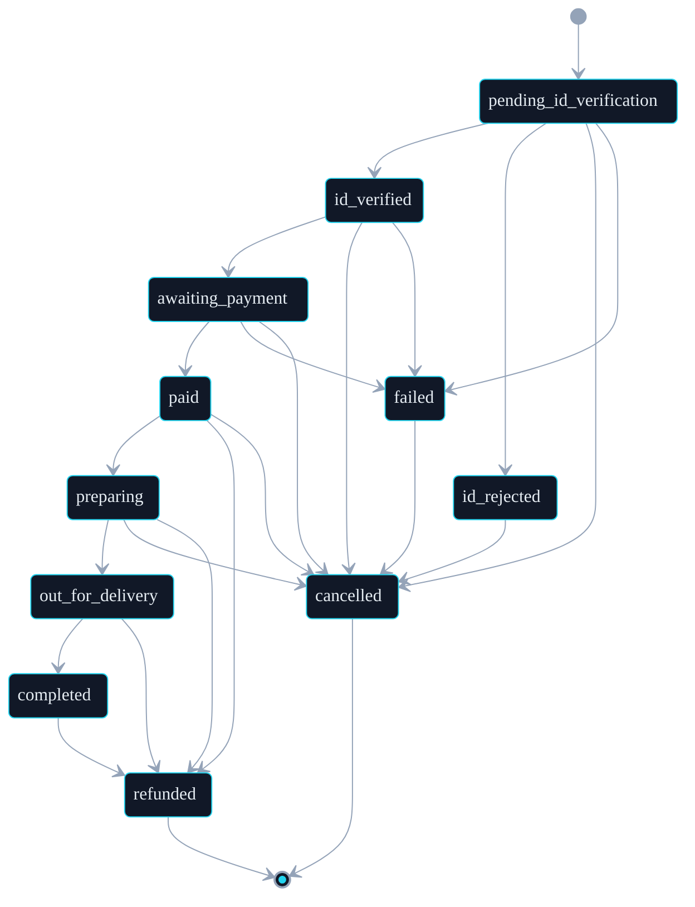

# Orders — Lifecycle, Schema, Event Log

> Source of truth: `apps/web/src/types/order.ts` + `apps/web/src/lib/repositories/order.repository.ts`.
> Update this doc whenever either file changes (project Doc Update Rule).

---

## Order Status State Machine

Lifecycle of an order from cart submission through delivery or refund. Mirrors `ALLOWED_TRANSITIONS` in `apps/web/src/types/order.ts` exactly — any change to that const requires a matching update here.

### Legend

| State                     | Meaning                                                                 |
| ------------------------- | ----------------------------------------------------------------------- |
| `pending_id_verification` | Initial state — order created, AgeChecker session opened.               |
| `id_verified`             | AgeChecker returned `pass`. Inventory has been atomically decremented.  |
| `id_rejected`             | AgeChecker returned `deny` or `underage`. Terminal except for cancel.   |
| `awaiting_payment`        | Clover Hosted Checkout session created; awaiting customer card capture. |
| `paid`                    | Clover capture confirmed. `paidAt` stamped.                             |
| `preparing`               | Operations packing the order. `preparingAt` stamped.                    |
| `out_for_delivery`        | Driver dispatched. `dispatchedAt` stamped.                              |
| `completed`               | Customer received delivery. `completedAt` stamped.                      |
| `cancelled`               | Order cancelled before fulfillment. `cancelledAt` stamped. Terminal.    |
| `refunded`                | Refund issued (full or partial). `refundedAt` stamped. Terminal.        |
| `failed`                  | Payment or system failure. Recoverable only via `cancelled`.            |

### Key Paths

- `apps/web/src/types/order.ts` — `OrderStatus` union + `ALLOWED_TRANSITIONS` const.
- `apps/web/src/types/order-event.ts` — audit event shape.
- `apps/web/src/lib/repositories/order.repository.ts` — `transitionStatus()` is the only writer. Guards `ALLOWED_TRANSITIONS`, stamps lifecycle timestamps, appends to event log atomically.
- `apps/web/src/app/api/webhooks/agechecker/route.ts` — drives `pending_id_verification → id_verified | id_rejected`.
- `apps/web/src/app/api/webhooks/clover/route.ts` — stub today (Path B); will drive `awaiting_payment → paid | failed | refunded | cancelled` once Path A is live (#302). See [clover-hosted-checkout.md](./clover-hosted-checkout.md#current-handler-state).

---

## Fulfillment Model

Orders are **delivery-only**. There is no in-store pickup at checkout — the `fulfillmentType` field has been removed. `locationId` is retained as the fulfillment origin (typically `'online'` for the storefront).

## Required Fields on Create

| Field                    | Type              | Notes                                 |
| ------------------------ | ----------------- | ------------------------------------- |
| `items`                  | `OrderItem[]`     | non-empty                             |
| `subtotal`/`tax`/`total` | cents             |                                       |
| `locationId`             | `string`          | fulfillment origin slug               |
| `deliveryAddress`        | `ShippingAddress` | required (delivery-only)              |
| `status`                 | `OrderStatus`     | `pending_id_verification` on POST     |
| `agecheckerSessionId`    | `string?`         | set when AgeChecker session is opened |

## Lifecycle Timestamps

Stamped by `transitionStatus` when the destination state matches:

| Status             | Timestamp field |
| ------------------ | --------------- |
| `paid`             | `paidAt`        |
| `preparing`        | `preparingAt`   |
| `out_for_delivery` | `dispatchedAt`  |
| `completed`        | `completedAt`   |
| `cancelled`        | `cancelledAt`   |
| `refunded`         | `refundedAt`    |

## Provider References

| Field                     | Meaning                                         |
| ------------------------- | ----------------------------------------------- |
| `agecheckerSessionId`     | AgeChecker verification session (pre-payment).  |
| `cloverCheckoutSessionId` | Clover Hosted Checkout session id.              |
| `cloverPaymentId`         | Clover payment id, set on capture from webhook. |

## Webhook → Status Mapping

| Provider   | Outcome                           | Status        | Notes                                  |
| ---------- | --------------------------------- | ------------- | -------------------------------------- |
| AgeChecker | `pass`                            | `id_verified` | Atomic inventory decrement on success. |
| AgeChecker | `deny` / `underage`               | `id_rejected` |                                        |
| AgeChecker | `manual_review` / `pending`       | (no-op)       | Logged, no transition.                 |
| Clover     | `payment.succeeded` (Path A only) | `paid`        | Stub today; see clover runbook.        |
| Clover     | `payment.failed`                  | `failed`      | Stub today.                            |
| Clover     | `payment.refunded`                | `refunded`    | Stub today.                            |
| Clover     | `payment.voided`                  | `cancelled`   | Stub today.                            |

See [agechecker.md](./agechecker.md) and [clover-hosted-checkout.md](./clover-hosted-checkout.md) for handler runbooks.

## Firestore Indexes

`(status ASC, createdAt DESC)` — admin order queues filter by status and sort newest-first. Defined in `firestore.indexes.json`.

## Event Log (Audit Subcollection)

Every status transition appends a record to `order-events/{orderId}/events/{eventId}`. Defined by `OrderEvent` in `apps/web/src/types/order-event.ts`. Admin SDK only — clients have no access (`firestore.rules` denies read/write).

| Field       | Type                                                                     | Notes                                                        |
| ----------- | ------------------------------------------------------------------------ | ------------------------------------------------------------ |
| `id`        | `string`                                                                 | Event doc id.                                                |
| `orderId`   | `string`                                                                 | Parent order id (denormalized for collection-group queries). |
| `from`      | `OrderStatus \| null`                                                    | Previous status. `null` only for the create event.           |
| `to`        | `OrderStatus`                                                            | New status.                                                  |
| `actor`     | `'system' \| 'webhook:agechecker' \| 'webhook:clover' \| `admin:${uid}`` | Origin of the transition.                                    |
| `meta`      | `Record<string, unknown>?`                                               | Provider payload (webhook id, refund reason, etc.).          |
| `createdAt` | `Date`                                                                   | Server timestamp.                                            |

All writers (webhook handlers, admin actions, scheduled jobs) MUST append an event when they mutate `orders/{id}.status`. The order doc remains the canonical state; the event log lets us reconstruct the lifecycle for support and dispute investigations.
